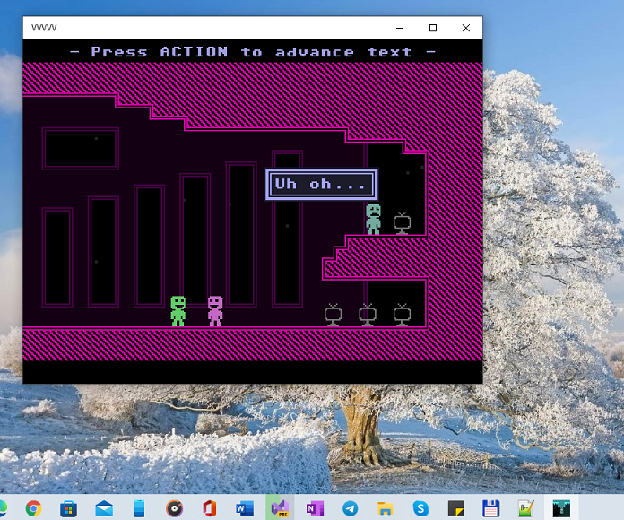

# VVVVVV game proto
An attempt to port of VVVVVV to the Windows 10 Phone via UWP.

My goal was to RnD (explore, re-learn foggoten...) some C++ features and SDL2(_mixer) libs "montage"...

## Screenshots

## Build instructions
You are able to build through Visual Studio 2022 (but only x64 is currently tested... howover, min os build 15063.. so, ARM may be ok...) 

## License
Whilst this project is open source VVVVVV's assets are not

The original repo and the full license can be found at:

https://github.com/TerryCavanagh/VVVVVV

The data.zip included is from the make and play edition with permission from Terry Cavanagh.

Proto. AS IS. SDL2 + SDL2_mixer RnD only. 

-- [m][e] 2022
