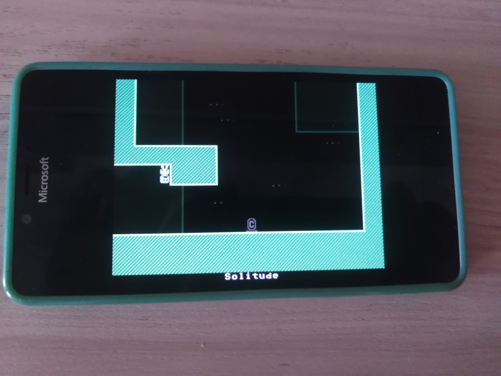
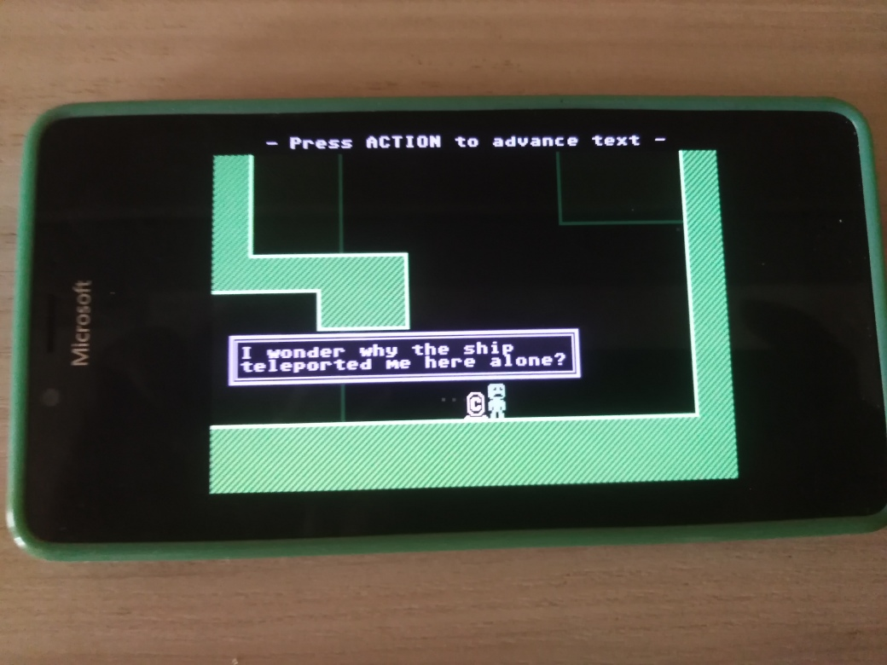
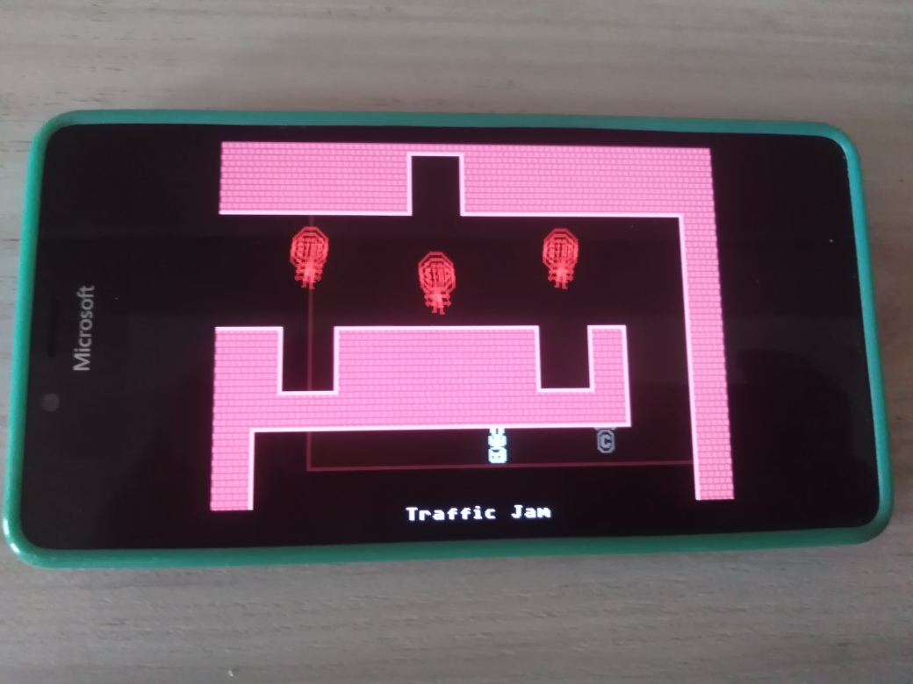
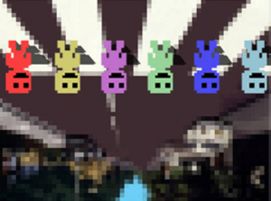

# VVVVVV 1.0.2-alpha - main branch

An attempt to port of VVVVVV to the Windows 10 Phone via UWP. Proto / Proof-of-concept

## Preface
My goal was to RnD (explore, re-learn foggoten...) some C++ features and SDL2(_mixer) libs "montage"...
This port based on  the source code to VVVVVV, version 2.0+. For more context about this release, see the [Terry's blog](http://distractionware.com/blog/2020/01/vvvvvv-is-now-open-source/). In general, if you're interested in creating 
something that falls outside the license terms, get in touch with Terry and we'll talk about it!

## Screenshots

## Whats new?
- Experimental touchscreen&mouse game input realized (in addition to keyboard input)

## Status
- Min. req. Win SDK decreased to 10240
- Minimal project files refactoring done (some bugs fixed, but not all... still no VS 2017 compatibility!) 

## Build instructions
You are able to build through Visual Studio 2022 (but only x64-based build result is currently tested successfully... 
ARM seems not be ok at now... maybe, touch screen game input damaged.. idk!) 

## Bugs
- It crash for me in Windows 10 Mobile (on real Lumia 950)

## TODO
-  Fix crashing in Windows 10 Mobile.

## Credits
- Creator of cool VVVVVV project [Terry Cavanagh](http://distractionware.com/)
- Room Names by [Bennett Foddy](http://www.foddy.net)
- Music by [Magnus Pålsson](http://souleye.madtracker.net/)
- Metal Soundtrack by [FamilyJules](http://familyjules7x.com/)
- 2.0 Update (C++ Port) by [Simon Roth](http://www.machinestudios.co.uk)
- 2.2 Update (SDL2/PhysicsFS/Steamworks port) by [Ethan Lee](http://www.flibitijibibo.com/)
- Beta Testing by Sam Kaplan and Pauli Kohberger
- Ending Picture by Pauli Kohberger

## Research / Exploded versions
There are two versions of the VVVVVV source code available - the [desktop version](https://github.com/TerryCavanagh/VVVVVV/tree/master/desktop_version) (based on the C++ port, and currently live on Steam), and the [mobile version](https://github.com/TerryCavanagh/VVVVVV/tree/master/mobile_version) (based on a fork of the original flash source code, and currently live on iOS and Android).

## Reference(s)
- https://github.com/TerryCavanagh/VVVVVV Non-UWP "original remake" of Terry Cavanagh
- http://distractionware.com/blog/2020/01/vvvvvv-is-now-open-source/ Terry's blog
- https://souleyedigitalmusic.bandcamp.com/track/pushing-onwards Main VVVVVV music theme / soundtrack by Magnus Pålsson 

## ..

AS IS. No support. SDL2-Mixer/WinRT RnD only. DIY.

## .

[M][E] July, 6 2025

