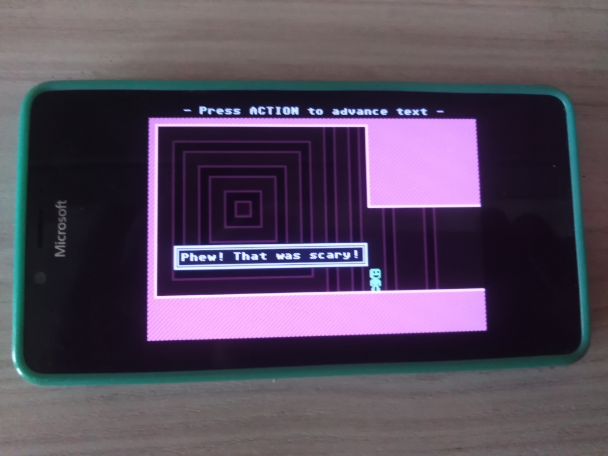

# VVVVVV 1.0.1-alpha

An attempt to port of VVVVVV to the Windows 10 Phone via UWP. Proto / Proof-of-concept

My goal was to RnD (explore, re-learn foggoten...) some C++ features and SDL2(_mixer) libs "montage"...

## Screenshots

## Whats new?
- Experimental touchscreen&mouse game input realized (in addition to keyboard input)

## Build instructions
You are able to build through Visual Studio 2022 (but only x64 is currently tested... howover, min os build 15063.. so, ARM may be ok...) 

## Bugs
- It crash for me in Windows 10 Mobile (on real Lumia 950)

## TODO
-  Fix crashing in Windows 10 Mobile.

## Reference(s)

https://github.com/TerryCavanagh/VVVVVV Non-UWP "original remake" of Terry Cavanagh.

## ..

AS IS. No support. SDL2-Mixer/WinRT RnD only. DIY.

## .

 [m][e] 2022-2025
